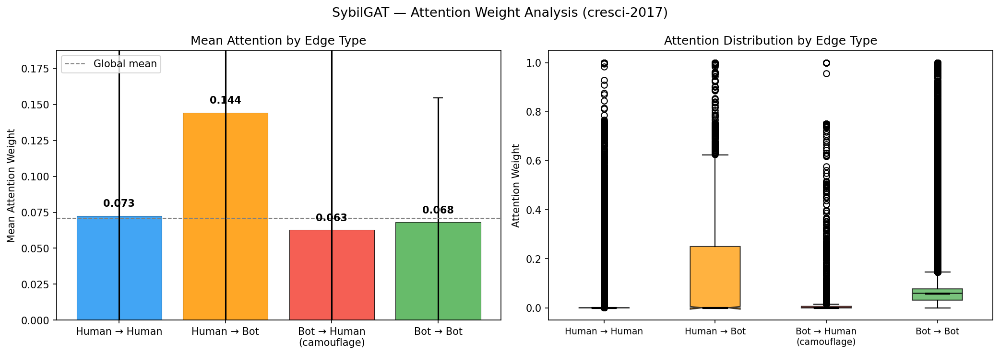
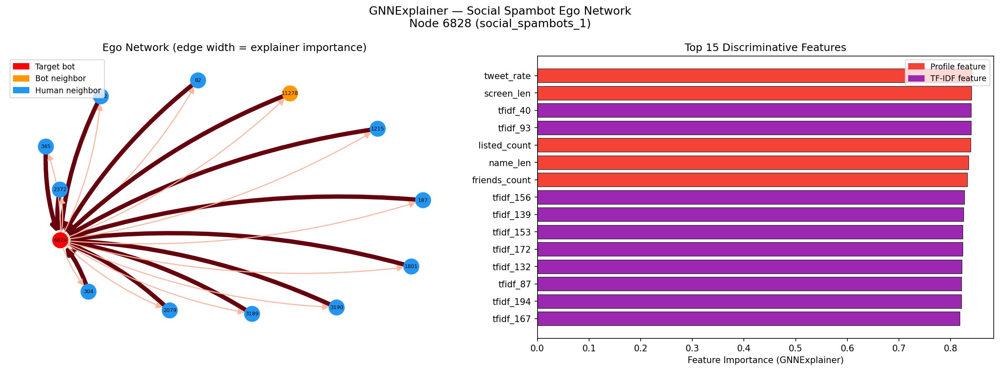

# SybilGAT — Graph Attention Network for Twitter Bot Detection

A Graph Attention Network (GAT) for detecting Twitter bots on cresci-2017. The core finding: GAT attention weights learn to **suppress bot→human camouflage edges** — statistically proven at p < 10⁻⁴¹.

---

## Key Finding — Attention Weight Analysis

| Edge Type | Count | Mean Attention |
|---|---|---|
| Human → Bot | 4,766 | **0.144** |
| Human → Human | 43,728 | 0.073 |
| Bot → Bot | 149,790 | 0.068 |
| **Bot → Human (camouflage)** | 4,766 | **0.063** |

Camouflage edges (bot→human) receive the **lowest attention of all four types**. Both comparisons are statistically significant via Mann-Whitney U test:
- Bot→Human < Bot→Bot: **p ≈ 0**
- Bot→Human < Human→Bot: **p = 1.3×10⁻⁴¹**

The elevated Human→Bot attention reflects the model learning to flag anomalous neighbors as discriminative signals — consistent with detection-oriented representation learning.



---

## Results — cresci-2017

14,368 users · 9 classes (1 genuine, 8 bot subtypes) · 203K edges (k-NN, k=10)

| Model | Accuracy | Macro F1 |
|---|---|---|
| Logistic Regression | 93.46% | 91.31% |
| GCN | 96.89% | 95.81% |
| SybilGAT | 97.12% | 96.18% |
| GraphSAGE | 97.22% | 96.29% |
| Random Forest | 98.79% | 98.41% |

> **On RF's 98.4%:** A published ACM WWW 2023 study documented that cresci-2017 is nearly linearly separable due to convenience sampling artifacts — two shallow decision trees achieve 98% accuracy. RF's win is a dataset property, not a model superiority. The 4.9% F1 gap between LR and any GNN is attributable to neighborhood aggregation.

---

## GNNExplainer — Ego Network

Per-account explainability: which neighbors and features drove the classification for a single social spambot.



Top discriminative features: `tweet_rate`, `screen_len`, TF-IDF tweet clusters. The bot's ego network shows it surrounded primarily by human neighbors — the camouflage pattern the model learns to flag.

---

## Architecture

```python
# 2-layer GAT with skip connection and BatchNorm
# Layer 1: GATConv(217 → 64 × 4 heads, concat=True)  → 256-dim
# Layer 2: GATConv(256 → 2,  heads=1,  concat=False)
# Skip:    Linear(217 → 2) added to layer-2 output
```

**Training:** Adam lr=5e-3, weight_decay=1e-4 · CrossEntropyLoss with class weights (3.14:1 human upweight) · ReduceLROnPlateau · Early stopping patience=20 · Grad clipping 1.0

---

## Features — 217 Total

**Profile (17):** `followers_count`, `friends_count`, `statuses_count`, `favourites_count`, `listed_count`, `verified`, `geo_enabled`, `default_profile`, `has_url`, `has_desc`, `name_len`, `screen_len`, `age_days`, `ff_ratio`, `tweet_rate`, `fav_rate`, `n_tweets`

**Tweet (200):** TF-IDF on concatenated tweet text · max 200 tweets/user · `min_df=3`, `sublinear_tf=True`

No per-sample normalization — preserves absolute amplitude differences. BatchNorm inside model.

---

## Graph Construction

No follow network available in this cresci-2017 download. Graph built via **k-NN (k=10) on feature similarity**, symmetrised → 203,050 edges. This is a proxy for a real social graph; on a true follow network, structural signals would be stronger.

---

## Setup

```bash
pip install torch torch_geometric torch_scatter torch_sparse \
    -f https://data.pyg.org/whl/torch-2.10.0+cpu.html
pip install scikit-learn pandas numpy matplotlib scipy
```

**Data:** Place cresci-2017 at `/content/drive/MyDrive/cresci/`  
File structure: `group.csv/group.csv/users.csv` and `tweets.csv` (double-nested)

```bash
python train.py
```

Or run the full pipeline in `notebooks/SybilGAT_clean.ipynb` on Google Colab.

---

## Repo Structure

```
sybilgat/
├── sybilgat.py          # SybilGAT, BotGCN, BotSAGE model classes
├── train.py             # Full training pipeline + baselines
├── notebooks/
│   └── SybilGAT_clean.ipynb
└── results/
    ├── attention_weights.png
    └── gnnexplainer_ego.png
```

---

## Limitations

- RF beats all GNNs due to cresci-2017's synthetically distinct bot classes (ACM WWW 2023)
- k-NN graph is a feature-similarity proxy, not a real follow network
- cresci-2017 is a 2017 benchmark — modern adversarial bots are harder to separate on tabular features alone
- All three GNNs (GCN, GraphSAGE, SybilGAT) cluster within 0.5% F1 — graph structure adds value, attention mechanism's specific contribution is interpretability over accuracy

---

## Citation

```bibtex
@inproceedings{cresci2017paradigm,
  title     = {The paradigm-shift of social spambots},
  author    = {Cresci, Stefano and Di Pietro, Roberto and Petrocchi, Marinella
               and Spognardi, Angelo and Tesconi, Maurizio},
  booktitle = {WWW},
  year      = {2017}
}
```
